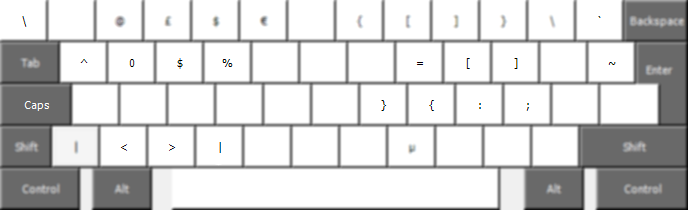

# SweVi

SweVi is a keyboard layout that removes for programmers ando other vi-users often unnessary keys and replaces them with move useful ones.

The layout replaces the `Caps Lock` key with `AltGr` to allow for a more easily accessible third layer on the keyboard.
It also adds additional keys for `<`, `>` and `|` and removes dead keys, keys that are pressed once and then wait for another keypress before anything happens. For example, to write a `~` on the normal Swedish keyboard layout, you have to press `AltGr+(~-key)->Space`. With this keyboard layout, that space isn't needed.

## Layout
Note that the keys denoted `Caps` below are actually `AltGr`.
#### Base layer

#### Shift layer

#### AltGr layer

The reason the curly brackets are placed in the order of `}{` rather than `{}` is because of the curly bracket command in Vim. If you leave them as `{}`, `AltGr+j` will move the cursor up the page, while the default behaviour of pressing `j` in Vim is to move the cursor down. If you would prefer the order to be `{}`, you can simply change the bindings, see instructions below.

## Installation

### Linux
On Linux, I've opted for using the utility program xmodmap to change the keybindings on startup rather than actually setting up a new keyboard layout. This makes the keybindings much more straighforward to personalize, if you wish to do so. 

- Install [xmodmap](https://wiki.archlinux.org/title/Xmodmap) from your distribution's package manager.
- Run [bindkeys.sh](linux/bindkeys.sh).

Bindings changed with xmodmap in this way only stay active until system reboot, but you can simply setup bindkeys.sh to run on startup if you want to use this keyboard layout as your default one.

#### Changing the bindings
If you would like to modify any bindings, you can use the [view-keycodes.sh](linux/view-keycodes.sh) script to find the correct keycodes and symbol names to use and then add the new bindings to the bindkeys script.

### Windows
- Run [CapsLockToAltGr.reg](windows/CapsLockToAltGr.reg) to remap `Caps Lock` to `AltGr` in the Windows registry.
- Run [setup.exe](windows/swevi/setup.exe) and go through the installation process.
- Reboot.
- SweVi should now be an option as a keyboard layout for Swedish.

#### Changing the bindings
If you would like to modify any bindings, you can download [Microsoft Keyboard Layout Creator](https://www.microsoft.com/en-us/download/details.aspx?id=102134) and create a new keyboard layout based on this keyboard's [source file](windows/src/SweVi.klc).

#### Note:
Since we have to change the `Caps Lock` binding through a registry entry on Windows, it will stay bound even if you uninstall the keyboard layout.

To restore this key to it's default behaviour:
- Open the Registry Editor by running `regedit` (`Win+R`).
- Locate the custom "Scancode Map" entry under `HKEY_LOCAL_MACHINE\SYSTEM\CurrentControlSet\Control\Keyboard Layout` and delete it.

